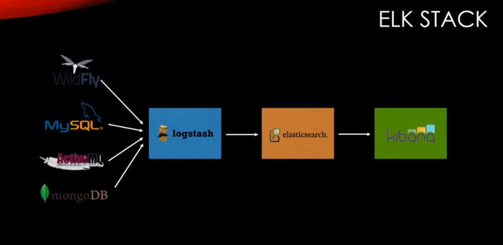

### ELK STACK

> 출처  [https://www.inflearn.com/course/elk-%EC%8A%A4%ED%83%9D-%EB%8D%B0%EC%9D%B4%ED%84%B0-%EB%B6%84%EC%84%9D/lecture/5494](https://www.inflearn.com/course/elk-스택-데이터-분석/lecture/5494) 

빅데이터를 사용하는데 가장 핫한 ELK Stack을 사용해보자!!

어떤 데이터든지 수집하고 빠르게 검색 쓸만한 정보를 보기좋게 시각화 할 수 있어야 합니다.

logstash는 어떤 데이터 베이스의 데이터 든지 csv 든지 상관없이 ES에 수집해주고,  

그리고 Kibana는 ES에 수집된 정보를 보기 좋게 화면에 보여줄 것이다.

#### ElasticSearch 설치

[설치 방법](# (..\..\CentOS 7\설치관련.md) )

